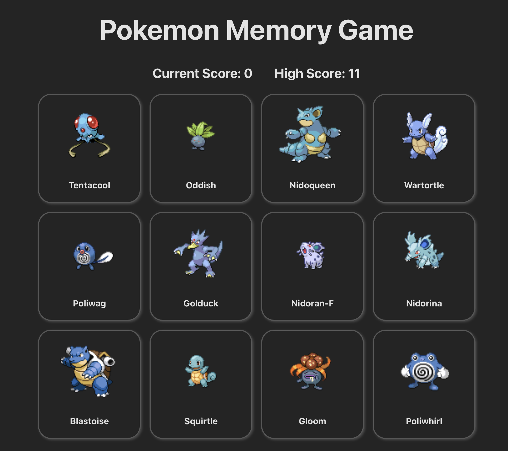

# Memory Game

A memory card game built with React and Vite. The objective of the game is to click on as many unique cards as possible without clicking the same card twice.

## Description

This memory game presents players with a grid of Pokémon character cards. The player must click on a card, and the game will track which cards have been clicked. If a player clicks on a card they have already clicked, their score resets to zero. The game keeps track of the current and highest scores.

## Table of Contents

- [Description](#description)
- [Screenshot](#screenshot)
- [Preview](#preview)
- [Features and Implementation](#features-and-implementation)
- [Installation](#installation)
- [Usage](#usage)
- [Tech Stack](#tech-stack)
- [License](#license)
- [Contact Information](#contact-information)

## Screenshot



## Preview

You can view a live preview of the page [here](https://memory-game-bb.netlify.app).

## Features and Implementation

1. **Card Rendering**:

   - Each card displays an image and name of a Pokémon character.
   - Components: `Card.jsx`, `CardContainer.jsx`.

2. **Score Tracking**:

   - The current score and high score are displayed.
   - Component: `Score.jsx`.

3. **Dynamic Data Fetching**:

   - Fetches Pokémon data from an external API.
   - File: `fetchData.js`.

4. **Game Logic**:

   - Tracks clicked cards and updates scores.
   - File: `App.jsx`.

5. **Styling**:
   - Responsive design using CSS Grid.
   - Files: `App.css`, `CardContainer.css`, `index.css`.

## Installation

1. Clone the repository:
   ```sh
   git clone https://github.com/sourdoughbredd/memory-game.git
   ```
2. Navigate to the project directory:
   ```sh
   cd memory-game
   ```
3. Install dependencies:
   ```sh
   npm install
   ```
4. Start the dev server:
   ```sh
   npm run dev
   ```

## Usage

To play the game, open the project in your browser after starting the dev server. Click on the cards to reveal Pokémon characters. Try to click on as many unique cards as possible without clicking the same card twice. The game keeps track of your current and highest scores.

## Tech Stack

- HTML
- CSS (CSS Modules)
- JavaScript
- React
- Vite

## License

This project is licensed under the MIT License.

## Contact Information

For any questions or suggestions, please contact Brett Bussell at [bwbussell24@gmail.com](mailto:bwbussell24@gmail.com).
